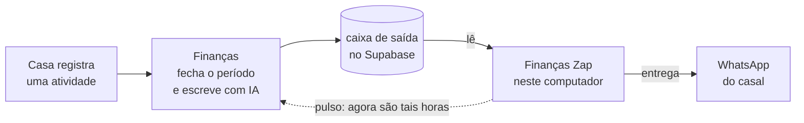

# Finanças Zap

A ponte entre a Casa e o WhatsApp — e o relógio dela.

Este é um processo pequeno que roda no computador de casa. Ele não sabe o que
aconteceu na Casa, não escreve mensagem e não consulta nada do módulo: pega o
texto pronto que o Finanças deixou numa caixa de saída, entrega no WhatsApp e
diz de volta se chegou.

O que ele faz de mais importante, porém, nem parece trabalho: **ele diz as
horas.** O Finanças não tem agendador. O resumo do dia, o panorama da semana, o
do mês e o fechamento de um bloco de registros só acontecem porque esta ponte
avisa o backend, antes de cada leitura, que o tempo passou. Ela não sabe o que
venceu — quem decide é o backend. Ela só bate o relógio.



Enquanto estiver ligado, o ciclo é sempre o mesmo:

1. avisa o Finanças que o tempo passou (`POST /casa/whatsapp/pulso`), sem dizer
   nem perguntar mais nada;
2. chama somente a função `ler_mensagens_whatsapp_casa` no Supabase;
3. recebe apenas `id`, `mensagem` pronta, a arte em base64 e `criada_em`;
4. repassa `mensagem` sem formatar, filtrar ou consultar dados da Casa, com a
   imagem como legenda quando ela vem;
5. entrega para os números configurados ou para um grupo;
6. devolve ao Finanças se a entrega deu certo
   (`confirmar_mensagem_whatsapp_casa`);
7. guarda a posição localmente, para recuperar mensagens após um reinício sem
   repetir o que o servidor do WhatsApp já confirmou.

Falhar no pulso nunca cala a entrega: uma mensagem que já está na caixa chega
mesmo com o backend fora do ar.

> `whatsapp-web.js` é uma integração não oficial. Use apenas para automação
> pessoal e de baixo volume. Mudanças no WhatsApp Web podem interromper o
> funcionamento, e o uso automatizado está sujeito às regras do WhatsApp.

## Pré-requisitos

- Windows 10 ou 11;
- Node.js 20 ou mais recente;
- uma chave restrita da ponte, gerada no app Casa;
- um celular com WhatsApp para conectar a sessão local.

## Instalação

```powershell
npm install
Copy-Item .env.example .env
```

## Configuração

No app, abra **Casa > Ajustes > WhatsApp**, gere a chave e clique em
**Copiar configuração**. Use no `.env` a URL e a chave pública `anon` do mesmo
Supabase do Finanças, além da chave restrita da ponte:

```env
SUPABASE_URL="https://SEU-PROJETO.supabase.co"
SUPABASE_ANON_KEY="..."
FINANCAS_BRIDGE_TOKEN="casa_wpp_..."
FINANCAS_API_URL="https://seu-backend.up.railway.app/api/v1"

WHATSAPP_RECIPIENTS="5511999999999,5511888888888"
WHATSAPP_GROUP_ID=""

POLL_INTERVAL_SECONDS="60"
HEADLESS="true"
```

Não configure e-mail, senha nem `SUPABASE_SERVICE_ROLE_KEY`. A chave `anon` é a
chave pública do projeto; a função do banco exige também a chave restrita da
ponte e retorna somente a caixa daquela residência. O banco guarda apenas o
hash dessa chave. Qualquer morador pode revogá-la ou rotacioná-la em
**Casa > Ajustes > WhatsApp**.

Em `WHATSAPP_RECIPIENTS`, separe os números por vírgula. O código também aceita
DDD + número e acrescenta o país configurado em `DEFAULT_COUNTRY_CODE` (55 por
padrão).

## Primeira execução

```powershell
npm run dev
```

Na primeira vez:

1. o terminal desenha um QR Code;
2. no celular, abra **WhatsApp > Aparelhos conectados > Conectar um aparelho**;
3. escaneie o QR Code;
4. aguarde as mensagens de que o WhatsApp e a caixa do Supabase estão prontos.

Na estreia, o cursor nasce no horário da inicialização. O histórico antigo não
é enviado. A partir daí, `.runtime/casa-notifications.json` registra a posição
e as entregas parciais. Se a ponte ficar desligada, ela recupera as novas
mensagens assim que voltar.

Feito o pareamento uma vez, a sessão fica salva: os próximos inícios não pedem
QR Code nenhum. É o que permite deixá-la subindo sozinha.

## Deixar ligada com o computador

Um comando põe a ponte para subir junto com o Windows, sem janela:

```powershell
npm run windows:instalar
```

Ele compila o projeto e cria uma tarefa no Agendador de Tarefas **do seu
usuário** — não pede administrador e não instala serviço nenhum. A tarefa:

- sobe a ponte **um minuto depois do logon**, enquanto o Windows ainda está
  arrumando a casa;
- **confere a cada dez minutos** se ela continua de pé, e a levanta se tiver
  caído (queda de internet, sessão do WhatsApp derrubada, desligamento);
- nunca sobe uma segunda cópia, mesmo se a conferência cair no meio de uma
  execução;
- roda com **prioridade abaixo do normal**, para nunca disputar processador com
  quem estiver usando a máquina;
- não tem limite de tempo de execução: ela pode ficar ligada por semanas.

Para ligar agora, sem esperar o próximo logon:

```powershell
Start-ScheduledTask -TaskName "Financas Zap"
```

Para ver como ela está — é assim que se olha para um processo sem janela:

```powershell
npm run windows:situacao
```

A saída diz o estado da tarefa, há quanto tempo a ponte está de pé, quantos
megabytes ela e o Chromium estão somando agora e as últimas linhas do diário.

Para tirá-la da inicialização (a sessão do WhatsApp e o cursor continuam
salvos):

```powershell
npm run windows:remover
```

### O diário

Sem console, o que a ponte diria na tela vai para
`.runtime/financas-zap.log`, com data e hora em cada linha. O arquivo tem teto
de 512 KB: ao encher, o trecho anterior vira `financas-zap.log.anterior` e a
escrita recomeça — um erro que se repita a cada minuto não vira um arquivo de
vários gigabytes.

É o lançador da inicialização que liga o diário, pela variável `LOG_PATH`. No
terminal ele fica desligado de propósito: ali você já está vendo tudo.

### Uma ponte por pasta

Duas cópias rodando ao mesmo tempo dividiriam o mesmo perfil do Chromium e a
mesma sessão do WhatsApp, e cada uma guardaria o próprio avanço do cursor — o
estrago aparece como a mesma mensagem chegando duas vezes no celular de quem
mora aqui. Por isso a ponte grava o próprio PID em
`.runtime/financas-zap.lock` e recusa subir enquanto o processo anotado ali
estiver vivo. Se ele já morreu, a trava é de quem chegou agora: um desligamento
abrupto não deixa a ponte impedida de voltar.

Na prática: se a inicialização automática estiver ativa e você quiser rodar
`npm run dev`, `npm run demo:casa` ou `npm run list:groups` na mão, encerre
antes a tarefa (`Stop-ScheduledTask -TaskName "Financas Zap"`).

## O que ela pesa

A ponte fica ligada o dia inteiro numa máquina de trabalho, não num servidor.
Isso é um requisito, não um detalhe:

- **um Chromium enxuto.** Sem GPU, sem rasterizador por software, sem som, sem
  aviso do sistema, com um renderizador só e com o cache de disco preso em
  32 MB — o que também segura o crescimento da pasta de sessão;
- **um pulso por minuto.** Nada do que a Casa manda é urgente ao segundo: o
  resumo tem hora marcada, o panorama tem dia marcado e o bloco fecha depois de
  uma espera que o backend define. Ajuste em `POLL_INTERVAL_SECONDS` se quiser
  outro ritmo;
- **prioridade abaixo do normal**, herdada da tarefa do Windows por todos os
  processos que ela abre;
- **teto de memória** no lado do Node, que só manuseia texto e a arte em
  base64.

O peso real na sua máquina, a qualquer momento, sai em `npm run windows:situacao`.

## Usar um grupo

Liste os grupos visíveis para a conta conectada:

```powershell
npm run list:groups
```

Copie o identificador terminado em `@g.us` para:

```env
WHATSAPP_GROUP_ID="120000000000000000@g.us"
```

Quando `WHATSAPP_GROUP_ID` está preenchido, o grupo substitui os números
privados; o aviso não é duplicado nos dois lugares.

## Testar os destinatários

Antes de deixar a ponte ligada, é possível enviar apenas `TEST_MESSAGE`:

```powershell
npm run test:message
```

O teste usa o mesmo grupo ou os mesmos números do monitor e encerra depois da
confirmação do servidor do WhatsApp.

## Testar a mensagem inteira

Para ver o caminho completo — texto escrito pela IA e imagem do Analytics —
com números inventados e assumidos como tal na primeira linha:

```powershell
npm run demo:casa
```

A ponte pede a demonstração ao Finanças, entrega o que estiver pendente na
caixa e encerra. Com `npm run demo:casa -- --demo=resumo_diario`, a prévia usa
o histórico de verdade sem gastar o resumo do período.

## Como o código está dividido

| Arquivo | Responsabilidade |
| --- | --- |
| `config.ts` | valida todo o ambiente antes de qualquer coisa subir |
| `backend-pulse.ts` | única porta para a API do Finanças (o pulso) |
| `supabase-outbox-client.ts` | única porta para o Supabase (ler e confirmar) |
| `whatsapp-client.ts` | única porta para o `whatsapp-web.js` |
| `message-monitor.ts` | o ciclo: pulso, leitura, entrega, confirmação, cursor |
| `state-store.ts` | retomada e idempotência local |
| `single-instance.ts` | a trava que impede duas pontes na mesma pasta |
| `log-file.ts` | o diário de quem roda sem tela |

## Validação

```powershell
npm test
npm run typecheck
npm run build
npm audit --omit=dev
```

## Solução de problemas

- **Chave recusada:** gere uma nova em **Casa > Ajustes > WhatsApp**, copie a
  chave para `FINANCAS_BRIDGE_TOKEN` e reinicie a ponte.
- **"Falha ao avisar o Finanças do horário":** confira `FINANCAS_API_URL` (com
  o `/api/v1`) e se o backend está no ar. A entrega do que já está na caixa
  continua funcionando; o que para de acontecer é o fechamento de novos
  períodos.
- **"Já existe uma ponte rodando nesta pasta":** é a trava fazendo o trabalho
  dela. Encerre a outra cópia — provavelmente a tarefa do Windows, com
  `Stop-ScheduledTask -TaskName "Financas Zap"`.
- **Nenhum resumo chega, mas a ponte está ligada:** confira em
  **Casa > Ajustes > WhatsApp** se o tipo de mensagem está ativo e se o horário
  já passou no fuso configurado.
- **A tarefa aparece como "Pronta" e nada acontece:** rode
  `npm run windows:situacao`. Resultado `2` significa que o projeto não estava
  compilado — rode `npm run build`.
- **Número não registrado:** use país + DDD + número e confirme que o contato
  possui WhatsApp.
- **Grupo não encontrado:** rode `npm run list:groups` novamente com a mesma
  conta conectada.
- **QR Code não apareceu:** aguarde o primeiro carregamento do Chromium e
  confira a conexão.
- **Sessão do WhatsApp corrompida:** encerre o processo, remova
  `.wwebjs_auth/` e `.wwebjs_cache/` e conecte novamente pelo `npm run dev`.
- **Estado local inválido:** preserve o arquivo para diagnóstico. Apagá-lo faz
  a ponte recomeçar no horário atual, sem recuperar o intervalo anterior.

## Arquivos privados

Não envie ao Git:

- `.env`, que contém a chave revogável da ponte;
- `.wwebjs_auth/`, que contém a sessão do WhatsApp;
- `.wwebjs_cache/`;
- `.runtime/`, que contém o cursor, as confirmações, a trava e o diário;
- `node_modules/`, `dist/` e logs.
