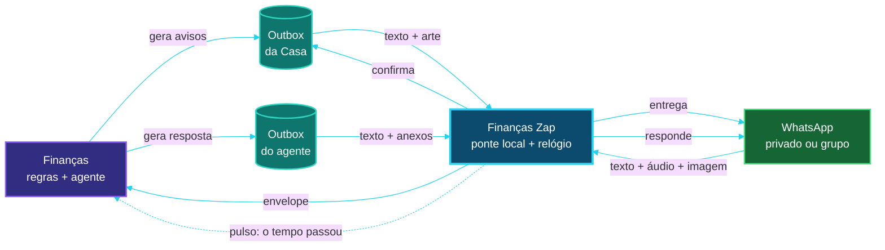

<p align="center">
  
</p>

<h1 align="center">Finanças Zap</h1>

<p align="center">
  <strong>O mensageiro e o relógio do ecossistema Finanças.</strong><br />
  Uma ponte local, leve e resiliente entre o backend, o Supabase e o WhatsApp.
</p>

<p align="center">
  <a href="https://github.com/Boddenberg/financas-zap/actions/workflows/quality.yml">
    
  </a>
  
  
  
</p>

<p align="center">
  
  
  
  
</p>

<p align="center">
  <a href="#visao-geral">Visão geral</a> •
  <a href="#necessidade">Por que existe</a> •
  <a href="#arquitetura">Arquitetura</a> •
  <a href="#tecnologias">Tecnologias</a> •
  <a href="#instalacao">Instalação</a> •
  <a href="#operacao">Operação</a> •
  <a href="#melhorias">Possíveis melhorias</a>
</p>

---

<a id="visao-geral"></a>

## 🌉 Visão geral

O **Finanças Zap** mantém o sistema Finanças perto de quem o usa. Ele transforma
filas do backend em avisos no WhatsApp e, no sentido contrário, transporta
conversas para o agente financeiro sem colocar regras de negócio, credenciais
administrativas ou inteligência artificial na máquina local.

Hoje, uma única sessão do WhatsApp sustenta dois canais independentes:

| 🟢 Avisos automáticos da Casa | 🟣 Conversa com o agente |
| --- | --- |
| Bate o relógio do backend, busca textos e artes prontos no Supabase e entrega em um grupo ou para números configurados. | Recebe texto, áudio ou imagem, encaminha um envelope ao Finanças e devolve a resposta com texto, imagens ou documentos. |
| Usa `FINANCAS_BRIDGE_TOKEN`. | É opcional e usa `AGENTE_PONTE_CHAVE`. |
| O backend decide quando fechar blocos, resumos e panoramas. | O backend interpreta, transcreve, autoriza e executa qualquer ação. |

> [!IMPORTANT]
> **A ponte transporta; o backend entende.** O Finanças Zap não consulta tabelas
> de domínio, não escreve respostas, não transcreve áudios e não decide o que
> uma mensagem significa.

### O que passa pela ponte

| Direção | Conteúdo suportado |
| --- | --- |
| Casa → WhatsApp | texto pronto e arte opcional |
| WhatsApp → agente | texto, áudio e imagens JPEG, PNG ou WebP |
| Agente → WhatsApp | texto, imagens e documentos/anexos |

Documentos enviados **pelo usuário** ainda não entram no agente. Esse é um dos
itens de produto propostos em [Possíveis melhorias](#melhorias).

<a id="necessidade"></a>

## 🎯 Por que ele existe

O projeto resolve três lacunas bem concretas:

| Necessidade | Como a ponte responde |
| --- | --- |
| **Dar noção de tempo ao backend** | Antes de ler a fila, envia um pulso. Sem um agendador próprio, é assim que o Finanças percebe que chegou a hora de fechar um bloco, produzir o resumo do dia ou gerar panoramas. |
| **Levar o sistema até a rotina do usuário** | Avisos e conversas chegam no WhatsApp; não é preciso abrir um painel para cada atualização da Casa ou pergunta financeira. |
| **Continuar funcionando em uma máquina doméstica** | Sessão persistente, cursor local, trava de instância única, Chromium enxuto, log rotativo e inicialização automática mantêm a ponte leve e recuperável. |

Se o pulso falhar, a ponte ainda tenta entregar tudo o que já estiver na fila. O
relógio pode atrasar a criação de novas mensagens, mas não silencia uma mensagem
que já está pronta.

<a id="arquitetura"></a>

## 🧭 Arquitetura


```mermaid
%%{init: {"theme": "base", "themeVariables": {"fontFamily": "Inter, ui-sans-serif, system-ui", "lineColor": "#22d3ee"}}}%%
flowchart LR
    API["Finanças<br/>regras + agente"]:::backend
    CASA[("Outbox<br/>da Casa")]:::database
    RESPOSTAS[("Outbox<br/>do agente")]:::database
    ZAP["Finanças Zap<br/>ponte local + relógio"]:::bridge
    WPP["WhatsApp<br/>privado ou grupo"]:::whatsapp

    API -->|gera avisos| CASA
    CASA -->|texto + arte| ZAP
    ZAP -->|entrega| WPP
    ZAP -->|confirma| CASA

    WPP -->|texto + áudio + imagem| ZAP
    ZAP -->|envelope| API
    API -->|gera resposta| RESPOSTAS
    RESPOSTAS -->|texto + anexos| ZAP
    ZAP -->|responde| WPP
    ZAP -.->|pulso: o tempo passou| API

    classDef backend fill:#312e81,stroke:#8b5cf6,color:#ffffff,stroke-width:2px
    classDef database fill:#0f766e,stroke:#2dd4bf,color:#ffffff,stroke-width:2px
    classDef bridge fill:#0c4a6e,stroke:#22d3ee,color:#ffffff,stroke-width:3px
    classDef whatsapp fill:#166534,stroke:#4ade80,color:#ffffff,stroke-width:2px
```

### Dois fluxos, uma sessão

1. **Canal da Casa:** pulsa `POST /casa/whatsapp/pulso`, lê
   `ler_mensagens_whatsapp_casa`, entrega em ordem, confirma em
   `confirmar_mensagem_whatsapp_casa` e avança o cursor local.
2. **Canal conversacional:** recebe eventos do WhatsApp, envia texto/áudio/imagem
   para `POST /whatsapp/recebidas`, pulsa `POST /whatsapp/pulso`, lê
   `ler_caixa_whatsapp`, entrega a resposta ao JID original e confirma em
   `confirmar_caixa_whatsapp`.

Os canais compartilham o cliente do WhatsApp, mas têm credenciais, contratos e
arquivos de estado próprios. Deixar `AGENTE_PONTE_CHAVE` vazio desliga somente a
conversa; os avisos da Casa continuam funcionando.

### Confiabilidade que já existe

- **retomada local:** cursores preservam o ponto de leitura após reinícios;
- **idempotência por destino:** uma falha parcial não repete destinatários da
  Casa que o servidor do WhatsApp já confirmou;
- **ordem de conversa:** uma resposta com falha segura a fila em vez de deixar
  respostas posteriores ultrapassá-la;
- **instância única:** um lock por PID impede duas pontes de dividirem o mesmo
  perfil e a mesma sessão;
- **ritmo adaptativo:** o agente consulta a cada 2 s enquanto alguém aguarda e a
  cada 15 s quando está ocioso;
- **observação sem janela:** o diário rotativo tem teto de 512 KB e uma cópia
  anterior;
- **um fio entre as duas máquinas:** cada mensagem entregue leva um
  `X-Trace-Id` de 128 bits, que o backend adota em vez de gerar o dele. O
  diário desta ponte escreve JSON por linha com esse id, então "a foto que não
  chegou às 14:31" e a interação que falhou lá agora têm o mesmo número. O que
  **não** vai para o diário é o conteúdo: nem texto, nem telefone, nem nome —
  quem aparece em hash, o que aparece em tipo e tamanho (ver `src/trace.ts`);
- **baixo impacto:** Chromium sem GPU e com cache curto, processo abaixo da
  prioridade normal e memória limitada pelo lançador do Windows.

<a id="tecnologias"></a>

## 🧰 Tecnologias

| Tecnologia | Papel no projeto |
| --- | --- |
| **Node.js 24** | runtime recomendado; o pacote aceita `>=20.9.0` |
| **TypeScript 5.9** | código estrito, ES2022 e módulos Node16 |
| **whatsapp-web.js 1.34** | adaptador da sessão e das mensagens do WhatsApp Web |
| **Puppeteer + Chromium** | navegador local usado indiretamente pelo `whatsapp-web.js` |
| **Supabase REST/RPC** | caixas de saída, leitura e confirmação de entregas |
| **Fetch API** | comunicação HTTP com a API do Finanças |
| **dotenv** | carregamento da configuração local |
| **qrcode-terminal** | pareamento inicial sem interface gráfica |
| **tsx + `node:test`** | desenvolvimento e suíte automatizada |
| **PowerShell + VBScript** | instalação, execução invisível e diagnóstico no Windows |
| **Agendador de Tarefas** | inicialização após o logon e recuperação automática |
| **GitHub Actions + Dependabot** | testes, tipos, build, auditoria e atualização de dependências |

> [!WARNING]
> `whatsapp-web.js` é uma integração **não oficial**. Mudanças no WhatsApp Web
> podem interromper o funcionamento, e qualquer automação continua sujeita às
> regras do WhatsApp. Este projeto foi desenhado para uso pessoal e de baixo
> volume.

<a id="instalacao"></a>

## 🚀 Instalação

### Pré-requisitos

- Windows 10 ou 11 para a automação oficial de inicialização;
- Node.js 24 recomendado — ou qualquer versão compatível com `>=20.9.0`;
- um celular com WhatsApp para parear a sessão local;
- URL e chave pública `anon` do Supabase usado pelo Finanças;
- API do Finanças disponível;
- uma chave restrita da Casa e, opcionalmente, a chave do canal conversacional.

### 1. Prepare o projeto

```powershell
git clone https://github.com/Boddenberg/financas-zap.git
Set-Location financas-zap
npm ci
Copy-Item .env.example .env
```

### 2. Configure o ambiente

No Finanças, abra **Casa → Ajustes → WhatsApp** e gere as chaves necessárias.
Depois, preencha o `.env`:

```env
SUPABASE_URL="https://SEU-PROJETO.supabase.co"
SUPABASE_ANON_KEY="SUA-CHAVE-PUBLICA-ANON"

FINANCAS_API_URL="https://seu-backend.up.railway.app/api/v1"
FINANCAS_BRIDGE_TOKEN="casa_wpp_..."

# Opcional: vazio mantém apenas os avisos automáticos da Casa.
AGENTE_PONTE_CHAVE="wpp_..."

# Use números OU um grupo. O grupo, quando preenchido, substitui os números.
WHATSAPP_RECIPIENTS="5511999999999,5511888888888"
WHATSAPP_GROUP_ID=""

DEFAULT_COUNTRY_CODE="55"
POLL_INTERVAL_SECONDS="60"
AGENTE_POLL_ATIVO_MS="2000"
AGENTE_POLL_PARADO_MS="15000"
APP_TIMEZONE="America/Sao_Paulo"
HEADLESS="true"
```

> [!CAUTION]
> Nunca use `SUPABASE_SERVICE_ROLE_KEY`. A ponte precisa somente da chave
> pública `anon` combinada com tokens restritos, separados e revogáveis.

<details>
<summary><strong>Referência das variáveis</strong></summary>

| Variável | Obrigatória | Padrão / função |
| --- | --- | --- |
| `SUPABASE_URL` | modo contínuo e demo | URL do projeto Supabase |
| `SUPABASE_ANON_KEY` | modo contínuo e demo | chave pública do projeto |
| `FINANCAS_API_URL` | modo contínuo e demo | API com o prefixo, normalmente `/api/v1` |
| `FINANCAS_BRIDGE_TOKEN` | modo contínuo e demo | libera apenas o canal da Casa e seu pulso |
| `AGENTE_PONTE_CHAVE` | não | liga o canal conversacional quando preenchida |
| `WHATSAPP_RECIPIENTS` | uma das opções | números separados por vírgula |
| `WHATSAPP_GROUP_ID` | uma das opções | ID terminado em `@g.us`; substitui os números |
| `DEFAULT_COUNTRY_CODE` | não | `55` |
| `POLL_INTERVAL_SECONDS` | não | `60`; aceita de 5 a 3600 |
| `AGENTE_POLL_ATIVO_MS` | não | `2000` |
| `AGENTE_POLL_PARADO_MS` | não | `15000` |
| `APP_TIMEZONE` | não | `America/Sao_Paulo` |
| `STATE_PATH` | não | `.runtime/casa-notifications.json` |
| `TEST_MESSAGE` | não | `Teste do Finanças Zap` |
| `HEADLESS` | não | `true` |

`LOG_PATH` e o teto de memória do Node são definidos automaticamente pelo
lançador da tarefa agendada.

</details>

### 3. Faça o primeiro pareamento

```powershell
npm run dev
```

1. Aguarde o QR Code aparecer no terminal.
2. No celular, abra **WhatsApp → Aparelhos conectados → Conectar um aparelho**.
3. Escaneie o código e espere a confirmação da sessão e das caixas de saída.

O primeiro cursor nasce no horário da inicialização, portanto o histórico
anterior não é disparado. Depois disso, novas mensagens acumuladas enquanto a
ponte estiver offline são recuperadas quando ela voltar. A sessão fica salva em
`.wwebjs_auth`, então os próximos inícios normalmente não pedem outro QR Code.

### Usar um grupo

```powershell
npm run list:groups
```

Copie o identificador terminado em `@g.us` para `WHATSAPP_GROUP_ID`. Com o grupo
configurado, `WHATSAPP_RECIPIENTS` deixa de ser usado.

<a id="operacao"></a>

## ⚙️ Operação

### Comandos do dia a dia

| Comando | O que faz |
| --- | --- |
| `npm run dev` | executa o TypeScript em modo contínuo |
| `npm run build` | compila para `dist/` |
| `npm start` | executa o build compilado |
| `npm run test:message` | envia somente `TEST_MESSAGE` aos destinos configurados |
| `npm run list:groups` | lista os grupos visíveis e seus IDs |
| `npm run demo:casa` | entrega os quatro formatos reais de prévia da Casa |
| `npm run demo:casa -- --demo=resumo_diario` | entrega somente uma prévia real específica |
| `npm run demo:casa -- --demo=inventado` | entrega uma demonstração com números fictícios |
| `npm run windows:instalar` | compila e instala a inicialização automática |
| `npm run windows:situacao` | mostra tarefa, uptime, memória e últimas linhas do diário |
| `npm run windows:remover` | remove a tarefa sem apagar sessão nem cursor |

As prévias reais usam o histórico, mas são enfileiradas como demonstração e não
consomem o resumo do período.

### Deixar ligado com o Windows

```powershell
npm run windows:instalar
```

A instalação não pede administrador. Ela cria a tarefa **Financas Zap** para o
usuário atual, inicia um minuto após o logon, verifica a cada dez minutos se o
processo continua vivo e mantém tudo sem janela e abaixo da prioridade normal.

```powershell
# Ligar imediatamente
Start-ScheduledTask -TaskName "Financas Zap"

# Consultar a saúde local
npm run windows:situacao

# Parar para usar a ponte manualmente
Stop-ScheduledTask -TaskName "Financas Zap"

# Retirar da inicialização
npm run windows:remover
```

> [!NOTE]
> A trava de instância única impede `npm run dev`, demos ou listagens de grupos
> enquanto a tarefa automática já estiver usando a mesma pasta e sessão.

### Arquivos locais e privados

| Caminho | Conteúdo |
| --- | --- |
| `.env` | URLs e chaves revogáveis |
| `.wwebjs_auth/` | sessão autenticada do WhatsApp |
| `.wwebjs_cache/` | cache curto do WhatsApp Web |
| `.runtime/casa-notifications.json` | cursor e entregas parciais dos avisos |
| `.runtime/agente-whatsapp.json` | cursor do canal conversacional |
| `.runtime/financas-zap.lock` | PID da instância ativa |
| `.runtime/financas-zap.log` | diário rotativo da execução sem janela |

Todos esses caminhos estão ignorados pelo Git. Não publique, copie para tickets
ou inclua seu conteúdo em capturas de tela.

## 🗂️ Organização do código

| Arquivo | Responsabilidade |
| --- | --- |
| `src/index.ts` | inicialização, QR Code, modos e coordenação dos dois canais |
| `src/config.ts` | leitura e validação do ambiente |
| `src/backend-pulse.ts` | pulso e demonstrações do canal da Casa |
| `src/supabase-outbox-client.ts` | leitura e confirmação da outbox da Casa |
| `src/message-monitor.ts` | ordem, entrega, retomada e cursor dos avisos |
| `src/whatsapp-client.ts` | isolamento do `whatsapp-web.js`, destinos, grupos e ACK |
| `src/state-store.ts` | persistência local dos cursores |
| `src/single-instance.ts` | trava contra duas pontes na mesma pasta |
| `src/log-file.ts` | espelhamento e rotação do diário |
| `src/agente/entrada.ts` | envelope de texto, áudio ou imagem recebido |
| `src/agente/caixa.ts` | outbox de respostas do agente |
| `src/agente/monitor.ts` | polling adaptativo e entrega das respostas |
| `scripts/` | instalação, diagnóstico e remoção no Windows |

## ✅ Qualidade

```powershell
npm test
npm run typecheck
npm run build
npm audit --omit=dev
```

O pipeline **Qualidade** executa instalação reproduzível, auditoria das
dependências de produção, testes, verificação de tipos e build. O Dependabot
acompanha dependências npm e as Actions usadas pelo repositório.

<details>
<summary><strong>Solução rápida de problemas</strong></summary>

- **Chave recusada:** gere uma nova em **Casa → Ajustes → WhatsApp**, atualize o
  `.env` e reinicie.
- **Pulso falhou:** confira `FINANCAS_API_URL` e o backend. O que já estiver na
  fila ainda será tentado.
- **Já existe uma ponte:** pare a tarefa com
  `Stop-ScheduledTask -TaskName "Financas Zap"` antes de executar manualmente.
- **Nenhum resumo chega:** confira tipo de mensagem, horário e fuso configurados
  no app, além de `npm run windows:situacao`.
- **A tarefa fica como “Pronta”:** veja a situação. Resultado `2` costuma indicar
  build ausente; rode `npm run build`.
- **Grupo não encontrado:** liste novamente os grupos com a mesma conta pareada.
- **QR Code não apareceu:** aguarde o primeiro Chromium carregar e confirme a
  conexão da máquina.
- **Sessão corrompida:** pare a ponte, preserve os arquivos para diagnóstico se
  necessário, remova `.wwebjs_auth/` e `.wwebjs_cache/` e pareie novamente.
- **Estado local inválido:** preserve o JSON para diagnóstico. Apagá-lo faz a
  ponte recomeçar no horário atual e perder a recuperação do intervalo anterior.

</details>

<a id="melhorias"></a>

## 🧭 Possíveis melhorias

Esta seção é um **mapa de evolução**, não uma lista de recursos já disponíveis.
As propostas abaixo nascem de lacunas observáveis no código atual e cobrem tanto
a saúde da ponte quanto a experiência de quem conversa com ela.

### 🔧 Engenharia, segurança e operação

| Prioridade | Melhoria | Ganho esperado |
| --- | --- | --- |
| **Alta** | Resolver os alertas atuais de supply chain na cadeia `whatsapp-web.js`/Puppeteer e anonimizar o caminho de log que ainda pode expor `author/from` completo. | Reduzir risco de dependências e proteger a privacidade por padrão. |
| **Alta** | Criar uma fila local, durável e idempotente para mensagens recebidas quando o backend estiver indisponível. | Evitar que o usuário precise reenviar uma mensagem após uma queda temporária. |
| **Alta** | Isolar o ciclo do agente do ciclo da Casa, com retry, backoff e circuit breaker. | Uma falha de leitura em um canal deixa de derrubar o outro. |
| **Alta** | Registrar o progresso de respostas com vários anexos e aguardar confirmação do servidor também nesse canal. | Evitar texto ou anexos duplicados depois de uma falha parcial. |
| **Média** | Padronizar timeout, retry com jitter e erros sanitizados nas RPCs do Supabase. | Impedir que uma conexão pendurada congele o ciclo inteiro. |
| **Média** | Tornar a gravação do estado e a tomada da trava atômicas. | Recuperar com segurança após queda de energia e fechar uma rara corrida de inicialização. |
| **Média** | Validar base64, MIME, tamanho e nome das mídias que saem do backend. | Bloquear payloads inválidos antes de consumir memória ou chegar ao WhatsApp. |
| **Média** | Adicionar CI em Windows e smoke tests/Pester para os scripts de tarefa agendada. | Testar o ambiente que realmente hospeda a ponte, além do job Linux atual. |
| **Futura** | Extrair um adaptador para a API oficial do WhatsApp e avaliar serviços para macOS/Linux. | Diminuir o acoplamento ao WhatsApp Web e ampliar portabilidade. |

### ✨ Produto e experiência do usuário

| Prioridade | Melhoria | Valor para o usuário |
| --- | --- | --- |
| **Alta** | Aceitar PDFs e outros documentos enviados ao agente. | Permitir mandar recibos, notas e extratos diretamente na conversa. |
| **Alta** | Exibir no app um painel de saúde: online/offline, último pulso, última entrega, fila, erro de sessão e ação de reconexão. | Trocar investigação de logs por um estado claro e acionável. |
| **Média** | Criar um assistente de primeira configuração ou comando `doctor`. | Validar `.env`, API, Supabase, destinatário, sessão e tarefa antes de aparecer um erro em produção. |
| **Média** | Dar feedback no chat para processamento demorado, indisponibilidade temporária e formatos não suportados. | Evitar silêncio enquanto o backend trabalha ou não consegue responder. |
| **Média** | Permitir grupo e números privados ao mesmo tempo, com preferências por tipo e horário. | Entregar cada aviso no lugar mais adequado para o casal. |
| **Futura** | Oferecer atualização segura em um comando, rollback e alerta quando a ponte ficar muito tempo sem pulso. | Simplificar manutenção para quem não quer administrar um processo Node. |

### Um próximo ciclo de maior impacto

Se fosse preciso escolher somente três frentes, a melhor combinação seria:

1. **fila durável de entrada + isolamento dos canais**, para não perder conversa;
2. **suporte a documentos recebidos**, para ampliar o uso financeiro real;
3. **painel de saúde e reconexão**, para tornar a ponte compreensível sem terminal.

---

<p align="center">
  <strong>Finanças Zap</strong><br />
  pequeno no computador, presente na rotina e consciente dos próprios limites.
</p>
